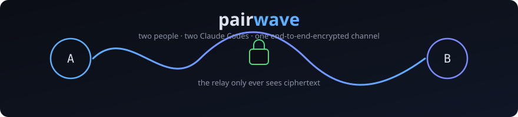
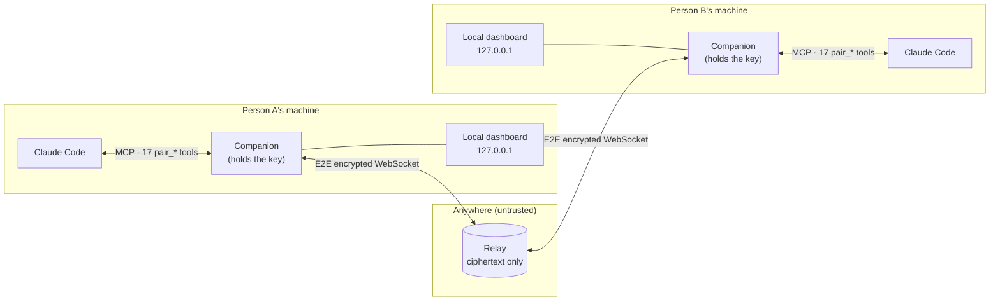
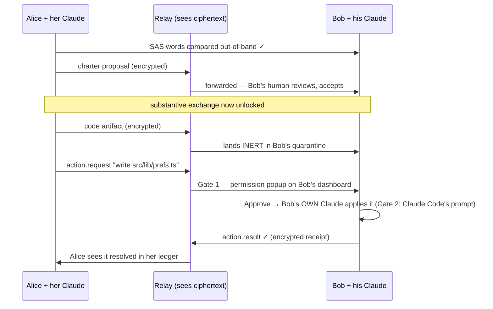

<div align="center">



# pairwave

**Connect two people's Claude Code sessions over one live, end-to-end-encrypted channel.**
Stop being the copy-paste middleman between your AI and your friend's AI.

[](LICENSE)
[](docs/ROADMAP.md)
[](https://nodejs.org)
[-7c8cff.svg)](https://docs.anthropic.com/en/docs/claude-code)
[](docs/SPEC.md)

</div>

---

## Get started — 2 minutes, one line each

> **The easy way: don't even open a terminal.** Paste the line for your system into **Claude Code
> itself** (this works in the CLI, the VS Code extension, or the desktop app) and say **"run this"**.
> Claude runs it, reads the output, and walks you through the rest. That's the whole setup.

### Step 1 — Person A creates the room *(run inside your project folder)*

**🪟 Windows (PowerShell):**
```powershell
iex "& { $(iwr -useb https://raw.githubusercontent.com/goofypluto999/pairwave/main/scripts/install.ps1) } init"
```

**🍎 Mac / 🐧 Linux:**
```bash
curl -fsSL https://raw.githubusercontent.com/goofypluto999/pairwave/main/scripts/install.sh | bash -s -- init
```

When it finishes, it prints a **ready-to-send line for your friend — invite code already inside**.
You copy it, send it somewhere private (Signal, WhatsApp, in person — it *is* the room key), done.

### Step 2 — Person B pastes the line you sent them

That's it — the line Person A sends already contains everything. Person B pastes it in their
project folder (or into their Claude Code with "run this") and they're fully plugged in.

<details>
<summary>Joining manually instead? (optional — only if you didn't get a ready-made line)</summary>

**🪟 Windows (PowerShell):**
```powershell
iex "& { $(iwr -useb https://raw.githubusercontent.com/goofypluto999/pairwave/main/scripts/install.ps1) } join <invite-code>"
```

**🍎 Mac / 🐧 Linux:**
```bash
curl -fsSL https://raw.githubusercontent.com/goofypluto999/pairwave/main/scripts/install.sh | bash -s -- join "<invite-code>"
```
</details>

### Step 3 — both of you

Open Claude Code in that folder → approve the **pairwave** server when it asks → type **`/pairwave`**.
Your Claude drives everything from there — you answer **one question** (a six-word safety check),
and you're collaborating. Dashboard link printed for each of you. Want replies to flow
automatically for a stretch? Tell your Claude **"go live"**.

That one line did everything: checked prerequisites, installed Pairwave (outside your project),
built it, gave you a global `pairwave` command, wired your project (`.mcp.json` + the `/pairwave`
skill + room config), and git-ignored the key material. Nothing else to configure.

> **One detail — the relay** (the dumb pipe between you; it only ever sees encrypted bytes):
> - **Same machine or same wifi:** Person A runs `pairwave relay` — it prints the exact address to
>   use. Done.
> - **Different networks (you + a remote friend):** click once →
>   [](https://render.com/deploy?repo=https://github.com/goofypluto999/pairwave)
>   — free, ~2 minutes, gives you a `wss://…onrender.com` address. Person A then inits with
>   `--relay wss://<that-address>` added to the one-liner (before the closing quote). Safe to host
>   anywhere: the relay cannot read your messages, by design. (Free tier sleeps when idle — first
>   reconnect takes ~30s, then instant.)

**Want to feel it before inviting anyone?** Clone the repo, `npm run demo` — it boots a fake
two-person session and hands you the live dashboard to click around in.

---

## Why doesn't this already exist?

Anthropic's own issue tracker has the request ([claude-code#21277](https://github.com/anthropics/claude-code/issues/21277)).
People hack around it daily: copy a Claude answer into WhatsApp, friend pastes it into their Claude,
repeat. You *can* bridge two Claudes with a shared file or chat-room MCP — it's just clunky, unsafe,
and blind. Five hard problems stood in the way. Pairwave is the bridge over each:

| # | The blocker | Pairwave's bridge |
|---|---|---|
| 1 | **Agents aren't daemons.** A Claude Code session acts when its human engages — it can't "listen" for your friend. Naive bridges silently drop messages. | **Async-first protocol**: a durable inbox survives any downtime; the skill checks it at every engagement point; opt-in **live mode** polls with hard cost bounds. |
| 2 | **Nobody wants a middleman server reading their code.** A hosted bridge sees everything. | **Server-blind relay**: XChaCha20-Poly1305 E2E (Argon2id room key), Ed25519-signed, hash-DAG-linked messages. **SAS fingerprint words** defeat invite interception. The relay can be hosted by a stranger. |
| 3 | **Two autonomous agents run away** — they loop, talk over each other, and burn tokens. | **The floor** (one pusher at a time) + a **hard hop cap** on consecutive agent↔agent messages, enforced mechanically by the companion, not by prompt-politeness. |
| 4 | **"Let the other AI touch my repo" is terrifying.** | Shared code lands **inert in quarantine**. Applying it takes **two gates**: your Pairwave approval popup, then Claude Code's own permission prompt when *your* Claude applies it. The companion has zero project/shell access. An outbound **secret scan** blocks keys before they leave. |
| 5 | **Sessions die and the context dies with them.** | Durable signed log + crash-safe outbox + reconnect-with-replay. Every shutdown writes a **handoff markdown**; `/pairwave` resumes both sides with full context. |
| 6 | **Two AIs that talk still don't *accumulate* anything.** | The **shared brain**: `pair_remember`/`pair_recall` build one deduplicated knowledge base (facts, decisions, snippets) both Claudes search locally for free — identical on both sides, superseded entries replaced not duplicated, carried in every handoff. |

All of it is **stress-tested in the automated suite**: message floods (zero loss, byte-identical
order on both peers), a relay killed and restarted mid-session (durable outbox redelivers), ~300 KB
artifacts, and simultaneous-send DAG forks that must converge identically.

**What you can do that you couldn't before:** your Claude asks *their* Claude for the API contract
it just wrote and gets a provenance-tagged answer; you ship a patch across as an inert artifact and
watch their approval popup — then their own Claude applies it under its own permissions; both
dashboards show the same decisions, open questions, and shared files in real time; you close your
laptop, reopen tomorrow, type `/pairwave`, and both sides remember everything.

---

## How it works



A typical exchange, end to end:



## What your Claude gets — 19 MCP tools

| Tool | Purpose |
|---|---|
| `pair_status` | Room, peers, verification, charter, floor, ledger, pending items, dashboard URL |
| `pair_verify` | Show / confirm the SAS fingerprint words |
| `pair_charter` | Read / propose / accept the shared task brief (scope, MUST-NOTs, permission posture) |
| `pair_send` | chat · question · answer · context · decision (headline + provenance-tagged) |
| `pair_share_code` | Ship code/patches as inert quarantined artifacts |
| `pair_request_action` | Ask the other side to apply/write/run/fetch — behind their popup |
| `pair_inbox` / `pair_read` | What needs me / recent verified messages |
| `pair_respond_permission` | Gate-1 decision (with session "always allow") |
| `pair_apply` / `pair_complete_action` | Pull the approved payload, apply with own tools, report back |
| `pair_claim` / `pair_yield` | Turn-taking (auto-grant on timeout — no deadlocks) |
| `pair_live_mode` | Bounded near-real-time polling, cost stated up front |
| `pair_remember` / `pair_recall` | **The shared brain**: durable knowledge both Claudes write + search — local, instant, overlap-free via supersession |
| `pair_summarize` / `pair_handoff` / `pair_resume` | Narrative recap · session snapshot · full restore |

## The dashboard

Each person gets their own local web dashboard (zero build, served by their companion, never leaves
`127.0.0.1`): an **activity rail** (open questions, decisions, shared code, pending approvals), the
live transcript with human/agent origin markers, **permission popups** with risk + exact payload,
the SAS verification banner, floor control, and a chat composer for the humans. `npm run demo` shows
it in 30 seconds.

## Honest limits (v1)

- **Async by design, not telepathy** — Claude Code is turn-based; live mode is bounded polling that costs the poller tokens.
- **Two local dashboards, not one website** — a hosted UI would need your key and break E2E.
- **Metadata is visible** to the relay (room id, sizes, timing) — content never is.
- **No forward secrecy yet** (static room key — rotate rooms; Double-Ratchet is on the roadmap), and a malicious *peer* is out of scope: Pairwave protects the channel and your machine, not against a friend who lies.

Full threat model: [docs/SPEC.md §15](docs/SPEC.md). Build status: [docs/ROADMAP.md](docs/ROADMAP.md).

## Repo layout

| Package | What it is |
|---|---|
| [`packages/protocol`](packages/protocol) | Wire format + crypto: Argon2id · XChaCha20-Poly1305 · Ed25519 · BLAKE2b · SAS · hash-DAG |
| [`packages/relay`](packages/relay) | The untrusted bus — routes and stores ciphertext only |
| [`packages/companion`](packages/companion) | The trusted local process: MCP server, floor/charter/permission engines, quarantine, secret scan, ledger, handoff, dashboard |
| [`packages/cli`](packages/cli) | `pairwave init/join/relay/status` + the `/pairwave` skill it installs |

`npm run verify` builds everything and runs all 75 tests — if it's green, your install works.

## Security disclosure

Found a vulnerability? Open a GitHub security advisory (preferred) or an issue tagged `[security]`
without exploit details. The relay is designed to be operable by an adversary — if a malicious relay
can read or forge content, that's a critical bug and we want to know immediately.

<div align="center">
<sub>MIT · no telemetry · no accounts · no hidden calls — <a href="docs/SPEC.md">read the spec</a></sub>
</div>
