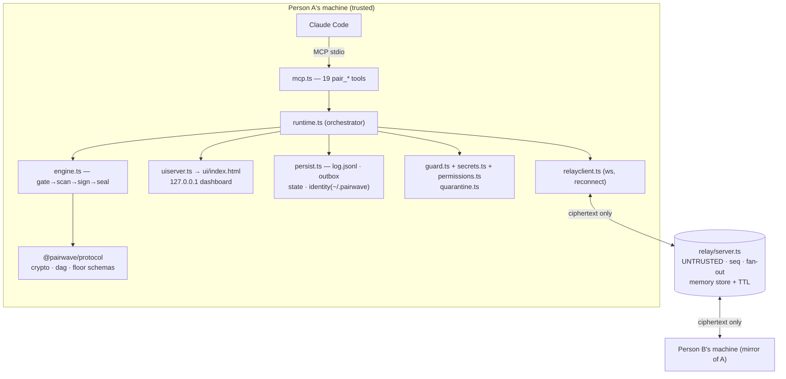

# Pairwave — Architecture Map

The complete system on one page. Detail lives in [SPEC.md](SPEC.md); status in [ROADMAP.md](ROADMAP.md).

## Packages & dependency direction
| Package | Depends on | Role |
|---|---|---|
| `@pairwave/protocol` | zod, libsodium-wrappers-sumo | Wire schemas, Argon2id/XChaCha20-Poly1305/Ed25519/BLAKE2b, SAS, hash-DAG, floor/turn types |
| `@pairwave/relay` | protocol, ws | Untrusted ciphertext bus: WS fan-out, seq, replay, presence, TTL store |
| `@pairwave/companion` | protocol, ws, @modelcontextprotocol/sdk | Everything trusted: engine, runtime, MCP tools, guards, ledger, brain, handoff, dashboard |
| `pairwave` (cli) | companion, relay | init/join/relay/status, invite codec, project wiring, skill install |
Dependency rule: **protocol ← relay/companion ← cli**; never sideways or upward. The dashboard is a static page (zero deps) served by the companion.

## Module map (companion = the product's brain)
engine.ts (pure send/ingest core) · runtime.ts (I/O composition: relay, persistence, side-effects) ·
floor.ts (turn enforcement + hop caps) · bootstrap.ts (SAS+charter gate) · guard.ts (danger filter) ·
secrets.ts (outbound key block) · permissions.ts (Gate 1) · quarantine.ts (inert code shelf) ·
ledger.ts (activity rail) · brain.ts (shared memory + recall) · handoff.ts (resume file) ·
mcp.ts (tool surface) · uiserver.ts (localhost API/SSE) · persist.ts (crash-safe disk) · relayclient.ts.

## Room security — why nobody can break into a room
1. **Finding it ≠ reading it**: the relay address is public, but a room needs the invite's
   `passphrase` (192-bit random) — Argon2id-derived into the AEAD key. The relay itself never has it.
2. **Eavesdropping**: XChaCha20-Poly1305 over every message; roomId bound as AEAD AD (no cross-room replay).
3. **Forgery/tampering**: every message Ed25519-signed by a pinned per-peer identity key + hash-DAG
   linked; any mutation fails verification on arrival and on every reload.
4. **Impersonation at invite time**: SAS six-word fingerprint compared out-of-band; key changes
   trigger a loud re-verify warning.
5. **A third joiner**: relay enforces 2 peers/room; without the passphrase they'd hold ciphertext only.
6. **Hostile peer actions**: danger guard + dual permission gates + zero companion disk/shell access.
Forward secrecy: content rides an ephemeral X25519 ECDH key (epoch 1), authenticated by the identity
signatures + SAS; the passphrase-derived room key (epoch 0) only protects the handshake. A later
passphrase leak therefore can't read recorded traffic; ephemeral keys are deleted on burn.
Residual (documented, SPEC §15): relay sees metadata (sizes/timing/presence); per-message ratchet
(post-compromise security) is v2; endpoint compromise is out of scope.

## Verification map (84 automated tests)
protocol 12 (crypto round-trip, tamper/forge/replay fail-closed, SAS, DAG) · relay 6 (E2E through
real WS, ciphertext-only store, replay, presence, 2-peer cap) · companion 61 (floor/hops, gates,
guard, secrets, quarantine, ledger, brain, engine e2e, full runtime e2e over real sockets, stress:
floods/outage-recovery/300KB/fork-convergence) · cli 5 (invite codec, wiring idempotency, no-clobber).
Plus live proofs: installer from GitHub URL on a clean path; internet round-trip through the public
community relay; dashboard browser-verified.

## Self-healing design
Installer re-run = pull + rebuild + junction fallback (fixes most breakage) · outbox redelivers after
any crash/outage · reconnect with replay · corrupt state files degrade to defaults, never crash ·
dropped envelopes surfaced, never silent · handoff on every shutdown. AI repair runbook:
[TROUBLESHOOTING.md](../TROUBLESHOOTING.md). Improvements flow back via [CONTRIBUTING.md](../CONTRIBUTING.md).
